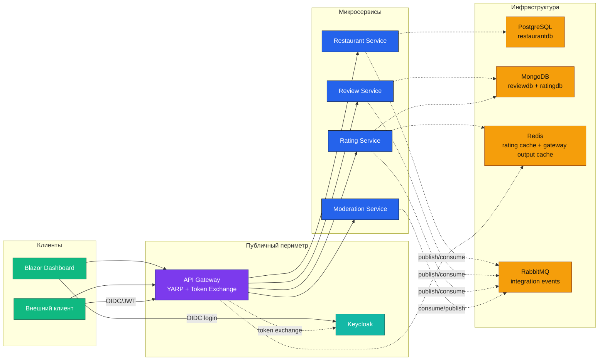
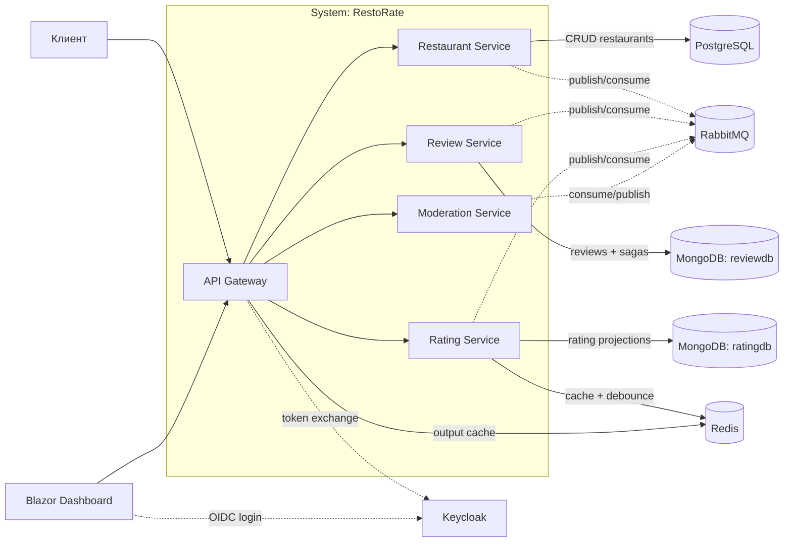
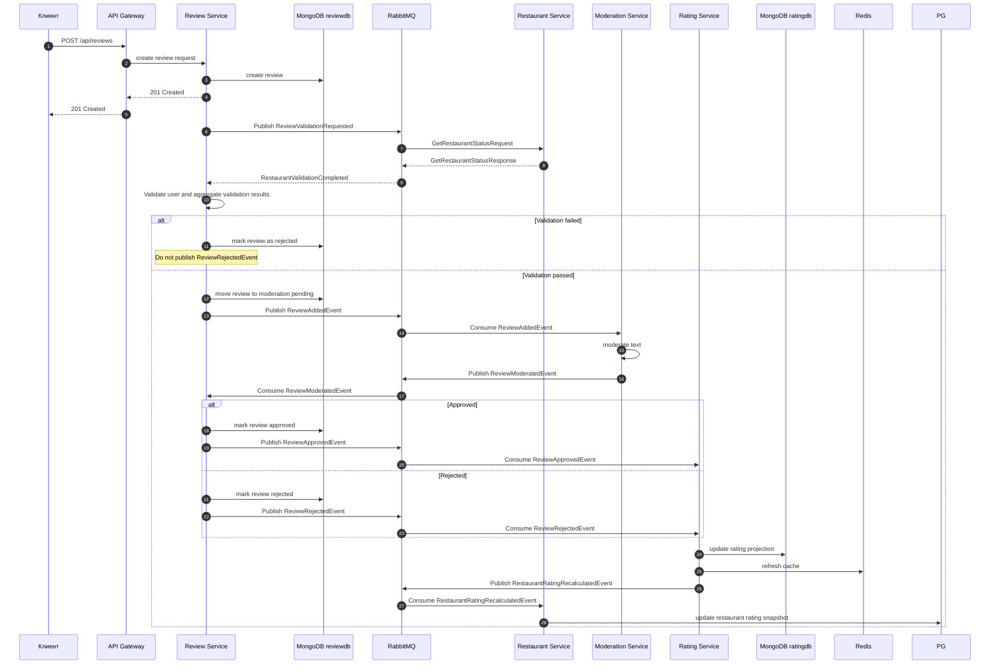
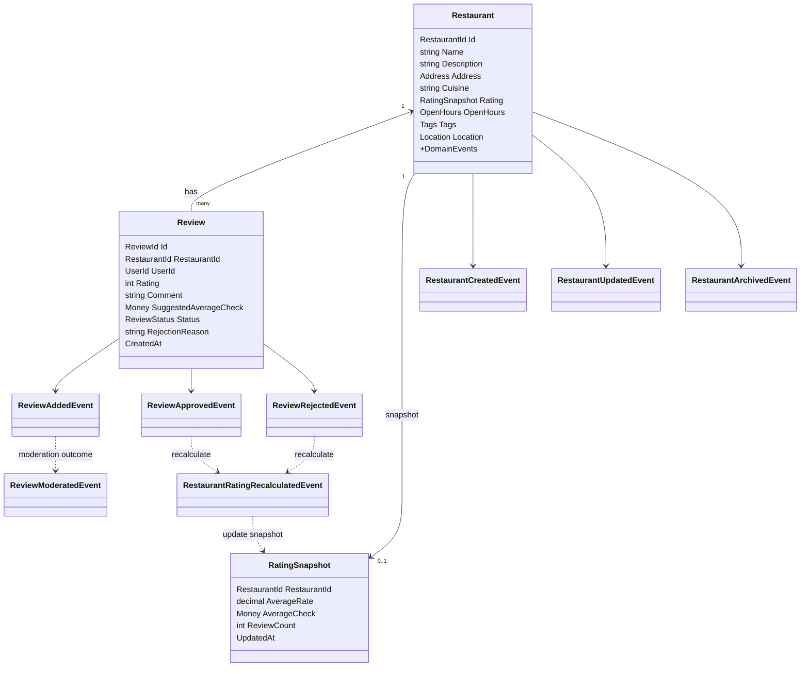

# Архитектура

Ниже приведены актуальные схемы в формате Mermaid для текущего состояния репозитория. Они отражают AppHost-конфигурацию, текущие хранилища сервисов, gateway/token exchange и фактические интеграции через RabbitMQ/MassTransit.

## 1. Общая архитектура

Примечания:

- `Moderation Service` в текущем AppHost не использует отдельное persistent storage.
- `Rating Service` использует `MongoDB` для собственных данных и `Redis` для кэша/дебаунса пересчёта.
- `Gateway` использует `Redis` для output cache.

## 2. Контейнерная схема

## 3. Поток: создание отзыва, валидация, модерация и пересчёт рейтинга

## 4. Схема событий

Подробные потоки интеграционных событий описаны по сервисам:

- Restaurant Service: см. [RestaurantService.md](./services/RestaurantService.md#интеграционные-события)
- Review Service: см. [ReviewService.md](./services/ReviewService.md#интеграционные-события)
- Moderation Service: см. [ModerationService.md](./services/ModerationService.md#интеграционные-события)
- Rating Service: см. [RatingService.md](./services/RatingService.md#интеграционные-события)

## 5. Упрощённая доменная и интеграционная модель

Примечание: эта схема намеренно упрощена. Она показывает текущие ключевые сущности и интеграционные события, но не заменяет документацию по конкретным use case, saga и consumer-ам.
