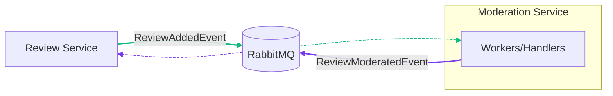
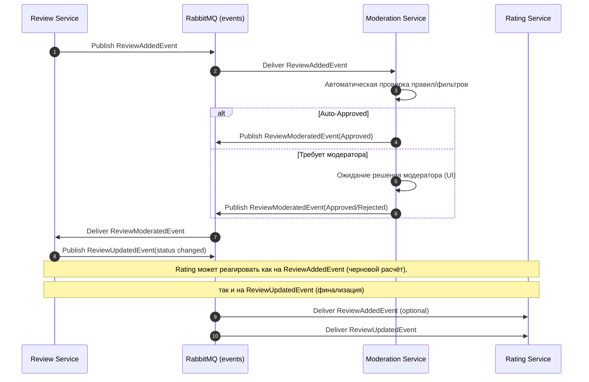

# Агрегаты сервиса Moderation

## ModerationTask

```csharp
namespace RestoRate.Moderation.Domain;

public sealed class ModerationTask : AggregateRoot<ModerationTaskId>
{
    private ModerationTask() { }

    private ModerationTask(
        ModerationTaskId id,
        ReviewId reviewId,
        RestaurantId restaurantId,
        UserId authorId,
        int rating,
        string comment,
        IReadOnlyCollection<string> tags)
    {
        Id = id;
        ReviewId = reviewId;
        RestaurantId = restaurantId;
        AuthorId = authorId;
        Rating = rating;
        Comment = comment;
        Tags = tags;
        Status = ModerationStatus.Pending;
        CreatedAt = DateTimeOffset.UtcNow;
    }

    public static ModerationTask FromReviewSnapshot(ReviewCreatedSnapshot snapshot)
        => new(
            ModerationTaskId.New(),
            snapshot.ReviewId,
            snapshot.RestaurantId,
            snapshot.AuthorId,
            snapshot.Rating,
            snapshot.Text,
            snapshot.Tags);

    public ReviewId ReviewId { get; private set; }
    public RestaurantId RestaurantId { get; private set; }
    public UserId AuthorId { get; private set; }
    public int Rating { get; private set; }
    public string Comment { get; private set; } = string.Empty;
    public IReadOnlyCollection<string> Tags { get; private set; } = Array.Empty<string>();
    public ModerationStatus Status { get; private set; }
    public string? DecisionReason { get; private set; }
    public string? ModeratorId { get; private set; }
    public DateTimeOffset CreatedAt { get; private set; }

    public void AutoApprove(string automatedRuleId)
    {
        if (Status != ModerationStatus.Pending) return;
        ModeratorId = automatedRuleId;
        Status = ModerationStatus.Approved;
        DecisionReason = "Auto-approved";
        AddDomainEvent(new ReviewModeratedDomainEvent(ReviewId, RestaurantId, true, DecisionReason, ModeratorId));
    }

    public void Approve(string moderatorId, string? reason)
    {
        if (Status == ModerationStatus.Approved) return;
        Status = ModerationStatus.Approved;
        ModeratorId = moderatorId;
        DecisionReason = reason;
        AddDomainEvent(new ReviewModeratedDomainEvent(ReviewId, RestaurantId, true, reason, moderatorId));
    }

    public void Reject(string moderatorId, string reason)
    {
        Status = ModerationStatus.Rejected;
        ModeratorId = moderatorId;
        DecisionReason = reason;
        AddDomainEvent(new ReviewModeratedDomainEvent(ReviewId, RestaurantId, false, reason, moderatorId));
    }
}
```

## Интеграционные события

- Подписывается на: `ReviewAddedEvent`
- Публикует: `ReviewModeratedEvent`



### Примечания

- Зелёный — события Review (Added): публикация из Review и доставка в Moderation.
- Фиолетовый — событие Moderation (`ReviewModeratedEvent`): публикация из Moderation и доставка в Review.
- Пунктир — доставка события от RabbitMQ к потребителю; сплошная линия — публикация события в RabbitMQ.

## Последовательность событий (Sequence)

Ниже представлена последовательность обмена интеграционными событиями вокруг модерации отзыва.



### Замечания по надёжности

- Все публикации/доставки подразумевают ретраи и идемпотентность обработчиков.
- В случае сбоев Moderation Service не публикует событие до тех пор,
  пока решение по задаче модерации не будет зафиксировано (outbox/транзакции на уровне инфраструктуры).

