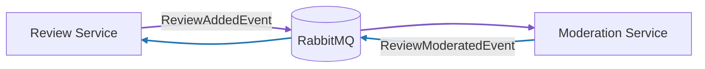

# Moderation Service

Сейчас это упрощённый тестовый сервис модерации. Его основная роль — принять событие о новом отзыве, прогнать простой набор правил и вернуть решение обратно в Review Service.

## Базовый концепт

- Потребляет `ReviewAddedEvent`.
- Выполняет простую автоматическую модерацию текста.
- Публикует `ReviewModeratedEvent` с признаком `Approved` и при необходимости с `Reason`.
- Внутренняя доменная модель сейчас вторична; ключевая ценность сервиса — событие на входе и событие на выходе.

## Интеграционные события

Входящие:

- `ReviewAddedEvent`

Исходящие:

- `ReviewModeratedEvent`

```mermaid
flowchart LR
    REV[Review Service]
    MOD[Moderation Service]
    MQ[(RabbitMQ)]

    REV -->|ReviewAddedEvent| MQ
    MQ --> MOD
    MOD -->|ReviewModeratedEvent| MQ
    MQ --> REV
    
    linkStyle 0 stroke:#7e57c2,stroke-width:2px
    linkStyle 1 stroke:#7e57c2,stroke-width:2px
    linkStyle 2 stroke:#1f77b4,stroke-width:2px
    linkStyle 3 stroke:#1f77b4,stroke-width:2px
```

## Что важно

- Moderation Service не управляет общим жизненным циклом отзыва, а только выдаёт решение по модерации.
- Финальное решение о публикации `ReviewApprovedEvent` или `ReviewRejectedEvent` остаётся за Review Service.
