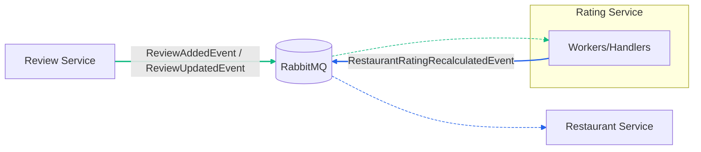
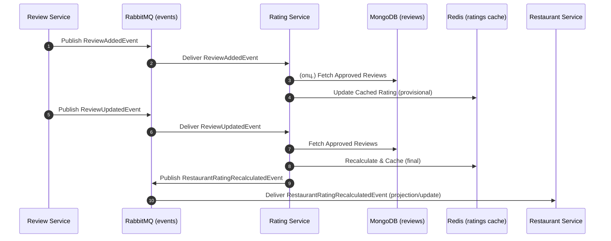

# Агрегаты сервиса Rating

## RestaurantRatingSnapshot

```csharp
namespace RestoRate.Rating.Domain;

public sealed class RestaurantRatingSnapshot : AggregateRoot<RestaurantId>
{
    private readonly Dictionary<ReviewId, ReviewScore> _scores = new();

    private RestaurantRatingSnapshot() { }

    private RestaurantRatingSnapshot(RestaurantId id)
    {
        Id = id;
        Current = RatingSummary.Empty();
    }

    public static RestaurantRatingSnapshot Create(RestaurantId restaurantId)
        => new(restaurantId);

    public RatingSummary Current { get; private set; }
    public RatingSummary Provisional { get; private set; } = RatingSummary.Empty();
    public IReadOnlyDictionary<ReviewId, ReviewScore> Scores => _scores;

    public void ApplyReviewCreated(ReviewId reviewId, int rating, bool isApproved)
    {
        _scores[reviewId] = new ReviewScore(rating, isApproved ? ReviewVisibility.Approved : ReviewVisibility.Pending);
        Recalculate();
    }

    public void ApplyReviewUpdated(ReviewId reviewId, int rating)
    {
        if (!_scores.TryGetValue(reviewId, out var entry)) return;
        _scores[reviewId] = entry with { Rating = rating };
        Recalculate();
    }

    public void ApplyReviewModerated(ReviewId reviewId, bool approved)
    {
        if (!_scores.TryGetValue(reviewId, out var entry)) return;
        _scores[reviewId] = entry with { Visibility = approved ? ReviewVisibility.Approved : ReviewVisibility.Rejected };
        Recalculate();
    }

    private void Recalculate()
    {
        Current = RatingSummary.From(_scores.Values.Where(s => s.Visibility == ReviewVisibility.Approved));
        Provisional = RatingSummary.From(_scores.Values.Where(s => s.Visibility != ReviewVisibility.Rejected));
        AddDomainEvent(new RestaurantRatingRecalculatedDomainEvent(Id, Current, Provisional));
    }
}
```

## ReviewScore и RatingSummary (вспомогательные типы)

```csharp
namespace RestoRate.Rating.Domain;

public sealed record ReviewScore(int Rating, ReviewVisibility Visibility);

public enum ReviewVisibility
{
    Pending,
    Approved,
    Rejected
}

public sealed record RatingSummary(decimal AverageRate, int ReviewCount, Money AverageCheck)
{
    public static RatingSummary Empty()
        => new(0m, 0, Money.Zero("RUB"));

    public static RatingSummary From(IEnumerable<ReviewScore> scores)
    {
        var list = scores.ToList();
        if (list.Count == 0) return Empty();
        var average = list.Average(s => s.Rating);
        return new RatingSummary((decimal)average, list.Count, Money.Zero("RUB"));
    }
}
```

## Интеграционные события

- Подписывается на: `ReviewAddedEvent`, `ReviewUpdatedEvent`
- Публикует: `RestaurantRatingRecalculatedEvent`



### Примечания

- Зелёный — события Review (Added/Updated): публикация из Review и доставка в Rating.
- Синий — события Rating (`RestaurantRatingRecalculatedEvent`): публикация из Rating и доставка в Restaurant для проекции.
- Пунктир — доставка события от RabbitMQ к потребителю; сплошная линия — публикация события в RabbitMQ.

## Последовательность событий (Sequence)

Ниже показан порядок обработки событий рейтингом ресторана.



### Замечания по надёжности

- Обработчики событий идемпотентны; кэш в Redis обновляется атомарно.
- В случае временной недоступности Redis — выполняется повторная попытка, состояние может быть восстановлено из проекций/хранилища отзывов.
