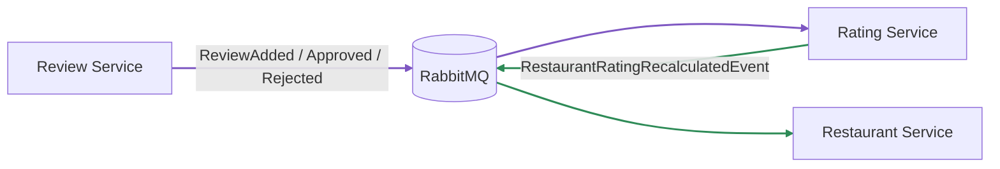

# Rating Service

Сервис собирает события по отзывам, пересчитывает агрегированный рейтинг ресторана и публикует обновлённую проекцию обратно в Restaurant Service.

## Базовый концепт

- Потребляет события Review Service.
- Хранит собственную проекцию рейтинга.
- Разделяет approved и provisional метрики.
- Использует `Redis` для кэша и debounce-механизма пересчёта.
- Публикует `RestaurantRatingRecalculatedEvent` для Restaurant Service.

## Интеграционные события

Входящие:

- `ReviewAddedEvent`
- `ReviewApprovedEvent`
- `ReviewRejectedEvent`

Исходящие:

- `RestaurantRatingRecalculatedEvent`

```mermaid
flowchart LR
    REV[Review Service]
    RAT[Rating Service]
    REST[Restaurant Service]
    MQ[(RabbitMQ)]

    REV -->|ReviewAdded / Approved / Rejected| MQ
    MQ --> RAT
    RAT -->|RestaurantRatingRecalculatedEvent| MQ
    MQ --> REST
    
    linkStyle 0 stroke:#7e57c2,stroke-width:2px
    linkStyle 1 stroke:#7e57c2,stroke-width:2px
    linkStyle 2 stroke:#2e8b57,stroke-width:2px
    linkStyle 3 stroke:#2e8b57,stroke-width:2px
```

## Что важно

- `ReviewAddedEvent` влияет на provisional-показатели.
- `ReviewApprovedEvent` и `ReviewRejectedEvent` фиксируют финальное состояние отзыва для рейтинга.
- Restaurant Service использует результат как готовую витрину, а не как источник расчёта.
