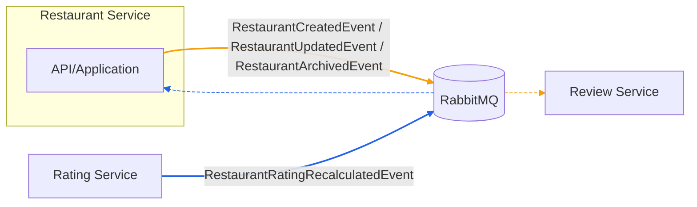
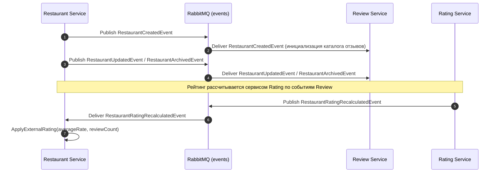

# Агрегаты сервиса Restaurant

## Restaurant

```csharp
namespace RestoRate.Restaurant.Domain;

public sealed class Restaurant : AggregateRoot<RestaurantId>
{
    private readonly List<string> _tags = new();
    private readonly List<Uri> _photos = new();

    private Restaurant() { }

    public Restaurant(RestaurantId id, string name, Address address, string cuisine)
    {
        Id = id;
        Name = name;
        Address = address;
        Cuisine = cuisine;
        Rating = RatingSnapshot.Empty();
        Status = RestaurantStatus.Draft;
        AddDomainEvent(new RestaurantCreatedDomainEvent(id));
    }

    public string Name { get; private set; }
    public string Description { get; private set; } = string.Empty;
    public Address Address { get; private set; }
    public string Cuisine { get; private set; }
    public IReadOnlyCollection<string> Tags => _tags.AsReadOnly();
    public IReadOnlyCollection<Uri> Photos => _photos.AsReadOnly();
    public RestaurantStatus Status { get; private set; }
    public RatingSnapshot Rating { get; private set; }

    public void Publish()
    {
        if (Status == RestaurantStatus.Published) return;
        Status = RestaurantStatus.Published;
        AddDomainEvent(new RestaurantPublishedDomainEvent(Id));
    }

    public void Archive()
    {
        if (Status == RestaurantStatus.Archived) return;
        Status = RestaurantStatus.Archived;
        AddDomainEvent(new RestaurantArchivedDomainEvent(Id));
    }

    public void UpdateProfile(string name, string description, Address address, string cuisine, IEnumerable<string> tags)
    {
        Name = name;
        Description = description;
        Address = address;
        Cuisine = cuisine;
        _tags.Clear();
        _tags.AddRange(tags);
        AddDomainEvent(new RestaurantUpdatedDomainEvent(Id));
    }

    public void ApplyExternalRating(decimal averageRate, int reviewCount)
    {
        Rating = Rating with { AverageRate = averageRate, ReviewCount = reviewCount };
        AddDomainEvent(new RestaurantRatingAppliedDomainEvent(Id, Rating));
    }

    public void ApplyAverageCheck(Money value)
    {
        Rating = Rating with { AverageCheck = value };
        AddDomainEvent(new RestaurantAverageCheckAppliedDomainEvent(Id, value));
    }
}
```

## Интеграционные события

- Публикует: `RestaurantCreatedEvent`, `RestaurantUpdatedEvent`, `RestaurantArchivedEvent`
- Подписывается на: `RestaurantRatingRecalculatedEvent`



### Примечания

- Оранжевый — события Restaurant (Created/Updated/Archived), публикуемые сервисом Restaurant и доставляемые в Review Service.
- Синий — событие Rating (`RestaurantRatingRecalculatedEvent`), публикуемое сервисом Rating и доставляемое обратно в Restaurant для проекции.
- Пунктир — доставка события от RabbitMQ к потребителю; сплошная линия — публикация события в RabbitMQ.

## Последовательность событий (Sequence)

Ниже показана последовательность событий вокруг жизненного цикла ресторана и обновления его рейтинга.



### Замечания по надёжности

- Публикации из Restaurant выполняются с outbox-паттерном, обработчики в Review/Restaurant — идемпотентны.
- Отсутствие события пересчёта рейтинга временно не блокирует операции Restaurant; проекция будет догнана после восстановления доставки.
