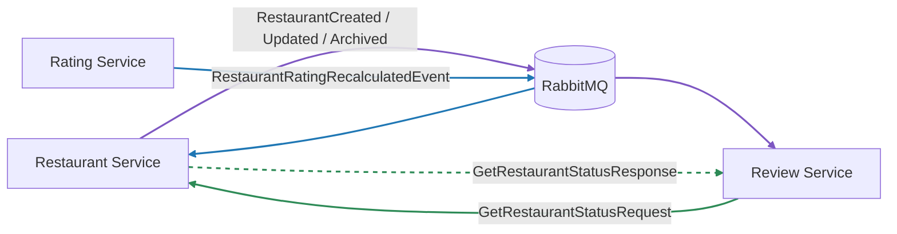

# Restaurant Service

Сервис отвечает за каталог ресторанов: создание, обновление, публикацию, архивирование и хранение витрины рейтинга ресторана.

## Базовый концепт

- Источник истины по ресторанам и их статусам.
- Публикует изменения ресторана для других сервисов.
- Принимает пересчитанный рейтинг от Rating Service и обновляет свой `RatingSnapshot`.
- Отвечает на межсервисный запрос `GetRestaurantStatusRequest`, который использует Review Service при валидации отзыва.

## Интеграционные события

Исходящие:

- `RestaurantCreatedEvent`
- `RestaurantUpdatedEvent`
- `RestaurantArchivedEvent`

Входящие:

- `RestaurantRatingRecalculatedEvent`

Межсервисный request/response:

- `GetRestaurantStatusRequest` -> `GetRestaurantStatusResponse`

```mermaid
flowchart LR
    REST[Restaurant Service]
    REV[Review Service]
    RAT[Rating Service]
    MQ[(RabbitMQ)]

    REST -->|RestaurantCreated / Updated / Archived| MQ
    MQ --> REV

    RAT -->|RestaurantRatingRecalculatedEvent| MQ
    MQ --> REST

    REV --> |GetRestaurantStatusRequest| REST
    REST -. GetRestaurantStatusResponse .-> REV
    
    linkStyle 0 stroke:#7e57c2,stroke-width:2px
    linkStyle 1 stroke:#7e57c2,stroke-width:2px
    linkStyle 2 stroke:#1f77b4,stroke-width:2px
    linkStyle 3 stroke:#1f77b4,stroke-width:2px
    linkStyle 4 stroke:#2e8b57,stroke-width:2px
    linkStyle 5 stroke:#2e8b57,stroke-width:2px,stroke-dasharray:5 5
```

## Что важно

- Restaurant Service не считает рейтинг сам, а только применяет готовую проекцию из Rating Service.
- Для Review Service этот сервис ещё и справочник статуса ресторана: существует ли ресторан и можно ли принимать по нему отзыв.
