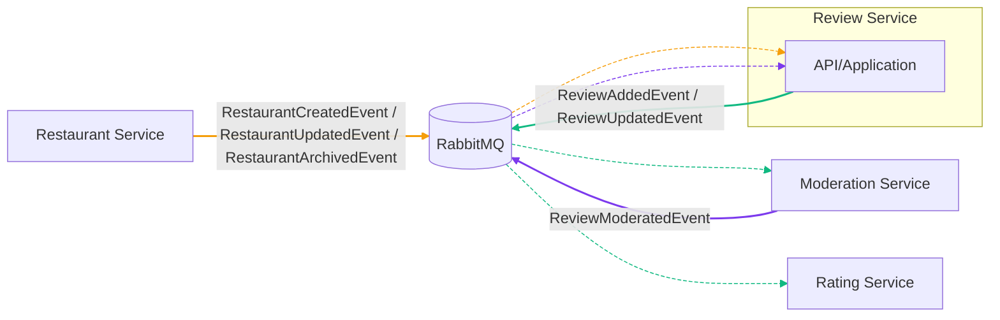
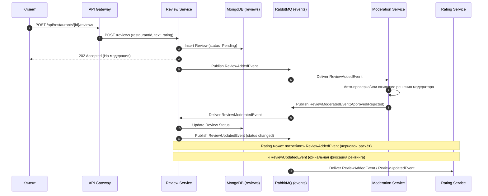

# Агрегаты сервиса Review

## Review

```csharp
namespace RestoRate.ReviewService.Domain;

public sealed class Review : AggregateRoot<ReviewId>
{
    private readonly List<ReviewStatusTransition> _history = new();

    private Review() { }

    private Review(
        ReviewId id,
        RestaurantId restaurantId,
        UserId authorId,
        int rating,
        string text,
        IEnumerable<string> tags,
        Money? suggestedAverageCheck)
    {
        Id = id;
        RestaurantId = restaurantId;
        AuthorId = authorId;
        Rating = rating;
        Comment = text;
        Tags = tags.ToArray();
        SuggestedAverageCheck = suggestedAverageCheck;
        Status = ReviewStatus.Pending;
        CreatedAt = DateTimeOffset.UtcNow;
        AppendStatus(Status, null, "initial submission");
        AddDomainEvent(new ReviewAddedDomainEvent(id, restaurantId, rating));
    }

    public static Review Create(
        ReviewId id,
        RestaurantId restaurantId,
        UserId authorId,
        int rating,
        string text,
        IEnumerable<string> tags,
        Money? suggestedAverageCheck = null)
        => new(id, restaurantId, authorId, rating, text, tags, suggestedAverageCheck);

    public RestaurantId RestaurantId { get; private set; }
    public UserId AuthorId { get; private set; }
    public int Rating { get; private set; }
    public string Comment { get; private set; } = string.Empty;
    public string[] Tags { get; private set; } = Array.Empty<string>();
    public Money? SuggestedAverageCheck { get; private set; }
    public ReviewStatus Status { get; private set; }
    public string? ModerationReason { get; private set; }
    public DateTimeOffset CreatedAt { get; private set; }
    public IReadOnlyCollection<ReviewStatusTransition> History => _history.AsReadOnly();

    public void UpdateContent(int rating, string text, IEnumerable<string> tags, Money? suggestedAverageCheck)
    {
        Rating = rating;
        Comment = text;
        Tags = tags.ToArray();
        SuggestedAverageCheck = suggestedAverageCheck;
        AddDomainEvent(new ReviewUpdatedDomainEvent(Id, RestaurantId, rating));
    }

    public void ApplyModerationDecision(ReviewStatus status, string? reason, string moderatorId)
    {
        if (Status == status) return;

        Status = status;
        ModerationReason = reason;
        AppendStatus(status, moderatorId, reason);
        AddDomainEvent(new ReviewModeratedDomainEvent(Id, RestaurantId, status, reason, moderatorId));
    }

    private void AppendStatus(ReviewStatus status, string? actorId, string? comment)
    {
        _history.Add(new ReviewStatusTransition(status, DateTimeOffset.UtcNow, actorId, comment));
    }
}
```

## Интеграционные события

- Публикует: `ReviewAddedEvent`, `ReviewUpdatedEvent`
- Подписывается на: `ReviewModeratedEvent` (публикуется сервисом Moderation),
  `RestaurantCreatedEvent`, `RestaurantUpdatedEvent`, `RestaurantArchivedEvent`



### Примечания

- Review Service поддерживает локальную проекцию «разрешённых ресторанов»,
    синхронизируемую событиями `RestaurantCreatedEvent` / `RestaurantUpdatedEvent` / `RestaurantArchivedEvent`.
- При создании отзыва сервис валидирует `RestaurantId` по этой проекции:
    отзыв можно добавить только для существующего и не архивированного ресторана.

Примечание по цветам стрелок:
- Оранжевый — события Restaurant (Created/Updated/Archived)
- Зелёный — события Review (Added/Updated)
- Фиолетовый — событие Moderation (ReviewModerated)
Пунктир — доставка события от RabbitMQ к потребителю; сплошная линия — публикация события.

## Последовательность событий (Sequence)

Последовательность создания и модерации отзыва с точки зрения Review Service.



### Замечания по надёжности

- Публикации осуществляются через outbox; потребители — идемпотентны.
- Временные сбои в Moderation или Rating не блокируют основную операцию создания отзыва — события будут доставлены повторно.
