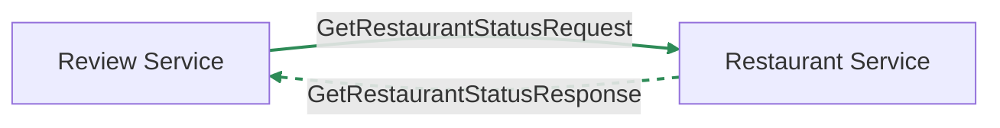
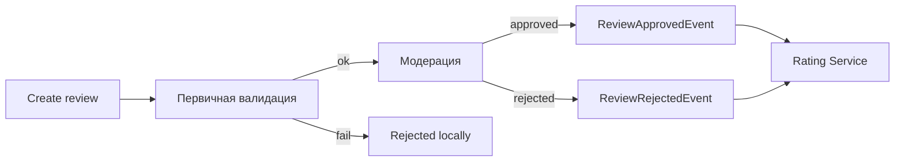
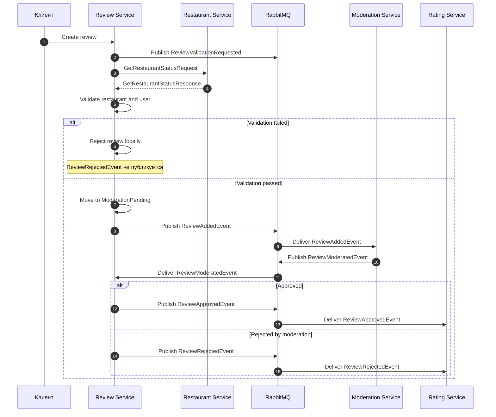

# Review Service

Сервис принимает отзывы, проводит первичную валидацию, отправляет отзыв на модерацию и публикует финальные события для пересчёта рейтинга.

## Базовый концепт

- Создаёт и хранит отзыв.
- Валидирует ресторан и пользователя перед переходом к модерации.
- Держит локальную проекцию ресторанов на основе событий из Restaurant Service.
- После решения модерации переводит отзыв в `Approved` или `Rejected`.
- Публикует события, которые использует Rating Service.

## Интеграционные события

Исходящие:

- `ReviewAddedEvent` — только после успешной первичной валидации и перехода в `ModerationPending`
- `ReviewApprovedEvent`
- `ReviewRejectedEvent` — только если отзыв отклонён именно после модерации

Входящие:

- `RestaurantCreatedEvent`
- `RestaurantUpdatedEvent`
- `RestaurantArchivedEvent`
- `ReviewModeratedEvent`

Межсервисные запросы:

- `GetRestaurantStatusRequest` -> `GetRestaurantStatusResponse`

```mermaid
flowchart LR
    REV[Review Service]
    REST[Restaurant Service]

    REV -->|GetRestaurantStatusRequest| REST
    REST -. GetRestaurantStatusResponse .-> REV

    linkStyle 0 stroke:#2e8b57,stroke-width:2px
    linkStyle 1 stroke:#2e8b57,stroke-width:2px,stroke-dasharray:5 5
```

## Общая схема

```mermaid
flowchart LR
    C[Create review]
    VAL[Первичная валидация]
    MOD[Модерация]
    RAT[Rating Service]

    C --> VAL
    VAL -->|ok| MOD
    VAL -->|fail| REJ[Rejected locally]
    MOD -->|approved| APP[ReviewApprovedEvent]
    MOD -->|rejected| REJMOD[ReviewRejectedEvent]
    APP --> RAT
    REJMOD --> RAT
```

## Детальный поток создания review

```mermaid
sequenceDiagram
    autonumber
    participant C as Клиент
    participant REV as Review Service
    participant REST as Restaurant Service
    participant MQ as RabbitMQ
    participant MOD as Moderation Service
    participant RAT as Rating Service

    C->>REV: Create review
    REV->>MQ: Publish ReviewValidationRequested
    REV->>REST: GetRestaurantStatusRequest
    REST-->>REV: GetRestaurantStatusResponse
    REV->>REV: Validate restaurant and user

    alt Validation failed
        REV->>REV: Reject review locally
        Note over REV: ReviewRejectedEvent не публикуется
    else Validation passed
        REV->>REV: Move to ModerationPending
        REV->>MQ: Publish ReviewAddedEvent
        MQ->>MOD: Deliver ReviewAddedEvent
        MOD->>MQ: Publish ReviewModeratedEvent
        MQ->>REV: Deliver ReviewModeratedEvent

        alt Approved
            REV->>MQ: Publish ReviewApprovedEvent
            MQ->>RAT: Deliver ReviewApprovedEvent
        else Rejected by moderation
            REV->>MQ: Publish ReviewRejectedEvent
            MQ->>RAT: Deliver ReviewRejectedEvent
        end
    end
```

## Что важно

- Review Service оркестрирует поток от создания отзыва до финального решения.
- `ReviewRejectedEvent` не означает любой отказ: он появляется только после модераторского отклонения.
